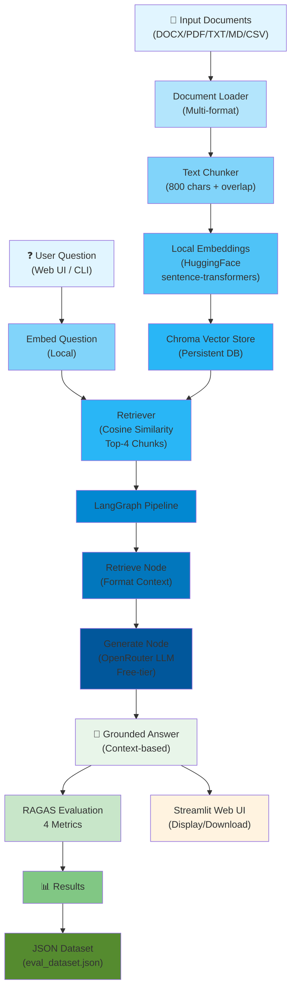
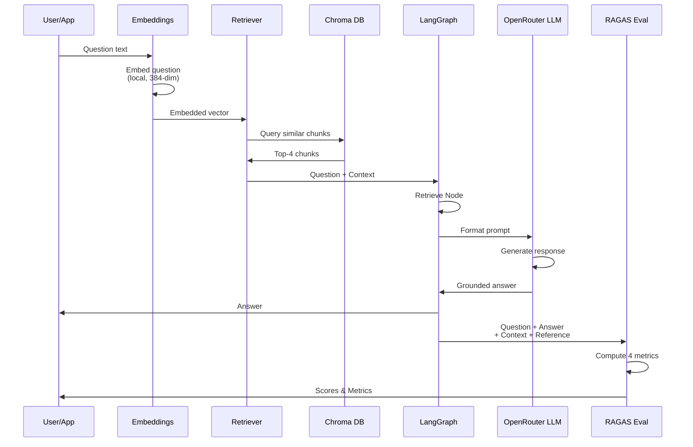
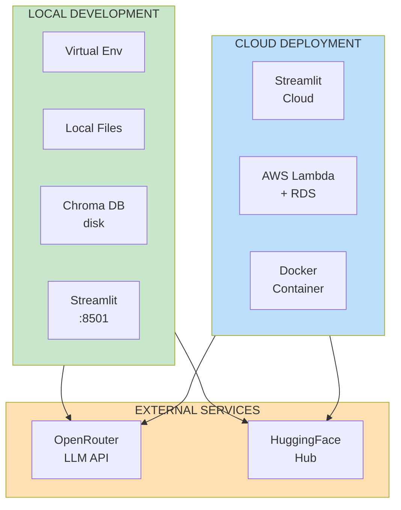
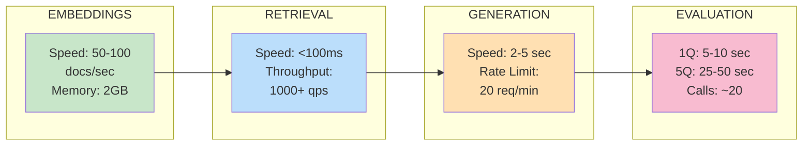
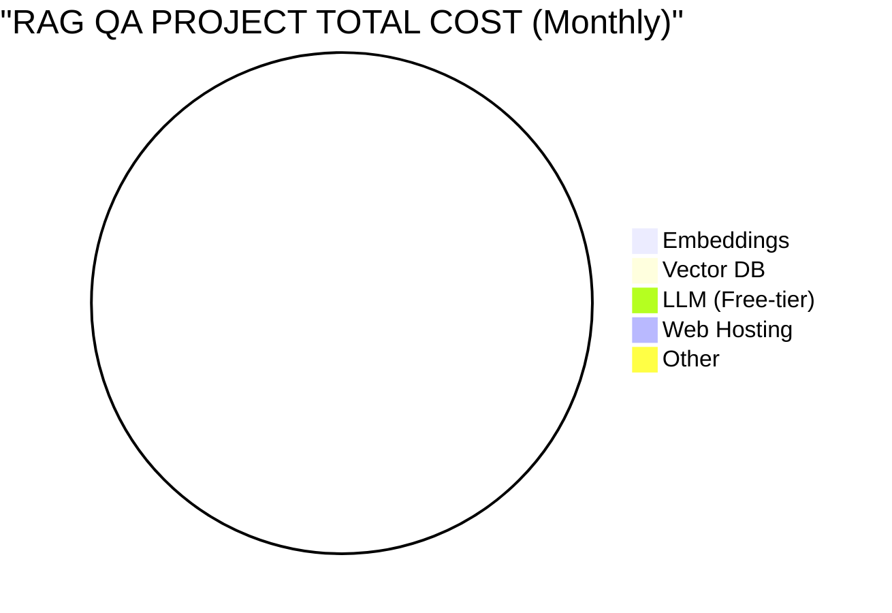
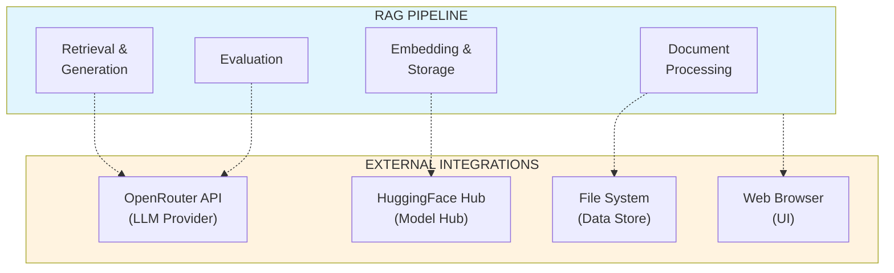
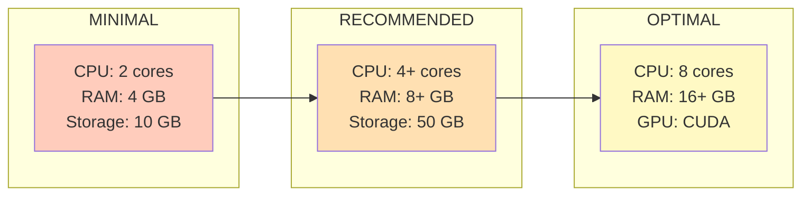
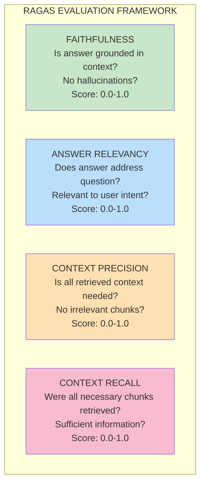

# RAG QA Architecture - Visual Diagram

## High-Level Architecture Flow

## Component Architecture

```mermaid
graph LR
    subgraph Input["🔵 INPUT LAYER"]
        I1["User<br/>Documents"]
        I2["Test<br/>Cases"]
        I3["Web<br/>Upload"]
    end
    
    subgraph Processing["🟢 PROCESSING LAYER"]
        P1["Document<br/>Loader"]
        P2["Chunker"]
        P3["Embeddings<br/>Generator"]
    end
    
    subgraph Storage["🟡 STORAGE LAYER"]
        S1["Chroma<br/>Vector DB"]
        S2["Metadata<br/>Store"]
    end
    
    subgraph Retrieval["🟠 RETRIEVAL LAYER"]
        R1["Retriever"]
        R2["Similarity<br/>Search"]
    end
    
    subgraph Generation["🔴 GENERATION LAYER"]
        G1["LangGraph<br/>Orchestrator"]
        G2["LLM<br/>OpenRouter"]
    end
    
    subgraph Evaluation["🟣 EVALUATION LAYER"]
        E1["RAGAS<br/>Metrics"]
        E2["Score<br/>Calculator"]
    end
    
    subgraph Output["🔵 OUTPUT LAYER"]
        O1["Results<br/>JSON"]
        O2["Web<br/>Dashboard"]
    end
    
    Input --> Processing
    Processing --> Storage
    Storage --> Retrieval
    Retrieval --> Generation
    Generation --> Evaluation
    Evaluation --> Output
    
    style Input fill:#e3f2fd
    style Processing fill:#f1f8e9
    style Storage fill:#fff8e1
    style Retrieval fill:#ffe0b2
    style Generation fill:#ffccbc
    style Evaluation fill:#f3e5f5
    style Output fill:#e0f2f1
```

## Data Flow - Question to Answer

## Technology Stack

```mermaid
graph TB
    subgraph Core["CORE FRAMEWORKS"]
        CF1["LangChain 0.3<br/>LangGraph 0.2<br/>RAGAS 0.2"]
    end
    
    subgraph Embeddings["EMBEDDINGS & VECTORS"]
        EMB1["HuggingFace<br/>Transformers"]
        EMB2["sentence-transformers<br/>all-MiniLM-L6-v2"]
        EMB3["Chroma 0.5<br/>Vector DB"]
    end
    
    subgraph LLM["LLM SERVICES"]
        LLM1["OpenRouter API"]
        LLM2["NVIDIA Nemotron<br/>Free-tier"]
    end
    
    subgraph Web["WEB INTERFACE"]
        WEB1["Streamlit 1.x"]
        WEB2["Python 3.9+"]
    end
    
    subgraph Utils["UTILITIES"]
        U1["datasets"]
        U2["python-dotenv"]
        U3["docx2txt"]
    end
    
    Core --> Embeddings
    Core --> LLM
    Core --> Web
    Embeddings --> Utils
    LLM --> Utils
    
    style Core fill:#1565c0
    style Embeddings fill:#6a1b9a
    style LLM fill:#c62828
    style Web fill:#f57f17
    style Utils fill:#004d40
```

## Deployment Architecture

## Performance Metrics

## Cost Breakdown

**Total Cost: $0.00 ✓ 100% FREE**

## Integration Points

## System Requirements

## RAGAS Evaluation Metrics

